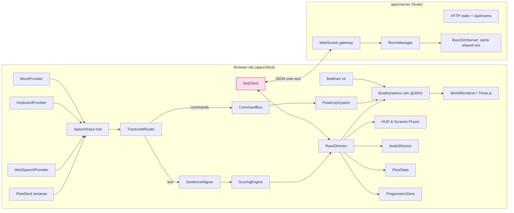
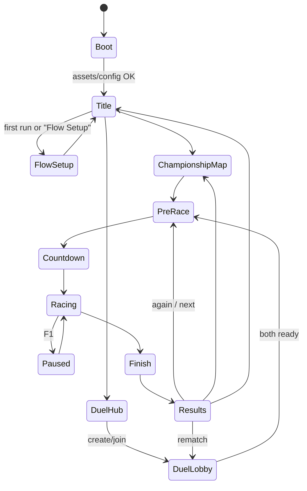
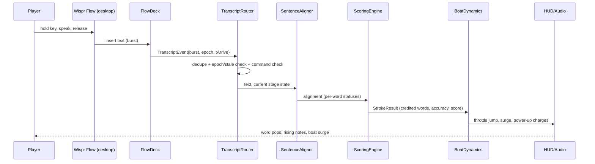

# 02 — ENGINE, ARCHITECTURE AND CODEBASE

> **Canonical owner of:** the **Canonical Decision table (CD-xx)**, engine choice, project/folder structure, module boundaries, interfaces, dependency rules, config/save formats, shared constants (`SIM_HZ`, etc.).
> If any other file disagrees with §0 below, **§0 wins**.
> Label key: **[VERIFIED]** (checked 2026-10-07) · **[PROPOSED]** · **[CREATIVE]** · **[UNVERIFIED]** · **[ASSUMPTION]**.

---

## 0. CANONICAL DECISION TABLE (all 8 files obey this)

| ID | Decision | Detail |
|---|---|---|
| **CD-01** | **Platform / engine** | **Browser game.** TypeScript + **Three.js** (WebGL renderer) + **Vite**. Desktop Chrome/Edge are the supported browsers (Windows primary, macOS secondary). |
| **CD-02** | **Repo layout** | npm **workspaces** monorepo: `packages/shared` (pure TS, no DOM/Three), `apps/client` (Vite app), `apps/server` (Node 22 + `ws`). |
| **CD-03** | **Speech architecture** | `ISpeechProvider` abstraction. **Primary = `FlowDeskProvider`** (Wispr Flow desktop app types/pastes dictated text into the game's always-focused **FlowDeck** textarea → final-only *bursts*). Fallbacks: `WebSpeechProvider` (interim+final), `KeyboardProvider` (typed, assist), `MockProvider` (tests/demo script). Optional: `FlowApiProvider` (needs Wispr-approved API access — never required). Detail: `03`. |
| **CD-04** | **Movement model** | **Spline-rail with free lateral steering.** Forward progress `s` along a course spline is driven by **throttle** (from dictation). Player steers laterally across the course corridor with **mouse-X** (default). Not lane-snapped, not 6-DOF physics. Numbers: `06`. |
| **CD-05** | **Scoring** | One deterministic `ScoringEngine` in `packages/shared`. Formulas canonical in `03 §7`; throttle mapping canonical in `06 §3`. |
| **CD-06** | **Networking** | Championship = fully local (no server). Voice Duel = **authoritative Node `ws` server**, rooms keyed by a **5-char code**, JSON protocol v1, shared deterministic sim (`packages/shared`). Detail: `04`. |
| **CD-07** | **Assets** | **P0: 100 % procedural kit generated in code** (game runs with zero external files). **P1: optional Blender-authored `.glb`** loaded through `AssetRegistry`, which falls back to the procedural factory on any failure. Detail: `05 §14`. |
| **CD-08** | **Controls** | **Mouse-first:** mouse-X steer, **LMB = Nitro**, **RMB = Wave Jump**, Shield automatic, **F1 = pause**. Keyboard alternative: ←/→ steer, ↑ Nitro, ↓ Wave Jump. **Rules:** never intercept printable keys; never bind **Esc** (Wispr Flow's *Cancel*); never use Ctrl/Win/Fn/Space combos. Reason: `03 §2.4` (hotkey/input conflict matrix). |
| **CD-09** | **Modes** | Exactly **two**: *Championship* and *Voice Duel*. Endless Tide, Daily Regatta, Flow Setup/Calibration are *inside* Championship (or Settings), not modes. |
| **CD-10** | **Sim timing** | `SIM_HZ = 30` (fixed step `SIM_DT = 1/30 s`) for the deterministic longitudinal sim (shared by client, bots, server). Render loop is free-running and **interpolates**. Duel snapshots `SNAPSHOT_HZ = 10`. |
| **CD-11** | **Vocabulary** | **Stage** = sentence · **Stroke** = chunk of a sentence · **Burst** = one text delivery from a provider · **Throttle** ∈ [0,1] · **Cadence** = rhythm metric · **Flow State** = meter-triggered 8 s bonus · **FlowDeck** = the always-focused textarea component. |
| **CD-12** | **Command channel** | Voice commands are **sentinel tokens** `[[nitro]]`, `[[jump]]`, `[[again]]`, `[[play]]`, `[[menu]]` (produced by Wispr Flow *snippets*), **or** a strict whole-burst phrase `vox <command>`. Commands are parsed **before** sentence alignment (`03 §8`). |
| **CD-13** | **UI technology** | HTML/CSS overlay above the canvas using **Preact 11** **[VERIFIED on npm 2026-10-07: 11.0.0]** with **@preact/signals 2.11.3**; the per-frame HUD (speed, ring) is updated through direct DOM refs, not re-renders. |
| **CD-14** | **Toolchain pins** | Versions seen on npm 2026-10-07: `three 0.186.1`, `@types/three 0.186.0`, `vite 8.3.3`, `typescript 7.0.2`, `vitest 5.0.3`, `@playwright/test 1.63.0`, `ws 8.22.0`, `qrcode 1.5.4`, `jsqr 1.4.0`, `zod 4.6.5`, `preact 11.0.0`, `@preact/signals 2.11.3`, `@preact/preset-vite 2.10.6`, `eslint 10.12.0`, `prettier 3.9.9`, `tsx 4.23.15`, `concurrently 10.0.5`, Node `22.x` (container has 22.22.0). **Opus must re-run `npm view <pkg> version` at project start and pin exact versions in `package-lock.json`.** If a major-version incompatibility blocks progress (e.g., TS 7 + a plugin), drop to the previous major rather than debugging tooling. |
| **CD-15** | **Renderer choice** | `THREE.WebGLRenderer` (WebGL2). WebGPURenderer is **not used** (browser/driver variability, Firefox caveats reported in secondary sources [UNVERIFIED]). |
| **CD-16** | **Server stays tiny** | One Node process: serves built client, `POST /api/rooms`, WebSocket `/ws`, optional `/api/flow/token`. In-memory rooms only; no database. |

---

## 1. Engine decision (with evidence and rejected alternatives)

### 1.1 Comparison **[PROPOSED]**

| Criterion | **Three.js / browser (CHOSEN)** | Unreal Engine 5 | Unity (C#) |
|---|---|---|---|
| Visual quality for a *stylised* toon look | Good — toon material, outlines, custom water shader are all straightforward | Excellent but overkill; heavy | Very good |
| **AI-agent coding compatibility** | **Best** — pure text files, hot reload, any LLM-friendly TypeScript; no editor GUI needed | Poor for Blueprints (binary assets); C++ possible but editor-bound | Medium — C# is text, but scenes/prefabs/inspector are editor-bound |
| **Wispr Flow integration** | **Native**: a normal `<textarea>` receives Flow's text with zero glue | Needs engine text-field/IME handling; paste/insert behaviour inside UE UI is uncertain [UNVERIFIED] | Similar uncertainty with Unity text inputs [UNVERIFIED] |
| **Friend joins from own laptop via QR/link** | **Zero install** — open URL | Friend must install a large build | Friend must install a build (WebGL export exists but heavy) |
| Multiplayer | Easy `ws` server, shared TS sim | Strong built-in replication (engine-specific, steep) | Netcode packages (setup-heavy) |
| Automated testing | **Vitest + Playwright** (headless, two-browser Duel tests) | Hard to run headless GUI tests | Test Framework exists; scene-bound |
| Build/iteration time | Seconds (HMR) | Minutes (shader compiles, packaging) | Tens of seconds–minutes |
| Packaging/deploy | Static files + one Node process | Large installer | Installer or WebGL build |
| Runtime on hackathon laptops | Fine at stylised fidelity | Heavy on integrated GPUs | OK |
| Feasibility in the available time (≈ 3 weeks to 28 Oct 2026; **[ASSUMPTION A4]**) | **High** | Low | Medium |

**Evidence status:** The engine comparison rests on engineering reasoning; **version numbers for UE/Unity were deliberately not researched** because neither is chosen **[UNVERIFIED, irrelevant to the decision]**. The decisive *verified* facts: (a) Wispr Flow dictates into whatever text field is focused on desktop [VERIFIED: `https://docs.wisprflow.ai` hotkey page + product descriptions]; (b) `getUserMedia`/webcam QR scanning needs HTTPS or localhost [VERIFIED: Wispr WebSocket quickstart notes the same secure-context rule, `https://api-docs.wisprflow.ai/websocket_quickstart`]; (c) Web Speech API is limited-availability and server-based [VERIFIED: `https://developer.mozilla.org/en-US/docs/Web/API/SpeechRecognition`].

**Risks / limits:** browser GPU variance; no native-grade post-processing; WebGL context loss. **Fallbacks:** dynamic quality tiers (`08 §11`), context-loss restore handler, 2D-HUD graceful degrade.

### 1.2 Blender
Used **only** for P1 asset upgrades (boats, hero props) exported as **glTF 2.0 `.glb`**. An AI agent cannot operate the Blender GUI; use **headless Python scripts** (`blender -b -P tools/blender/<script>.py`) **[PROPOSED; Blender CLI background mode is standard but not re-verified today → UNVERIFIED]**. Procedural kit stays the permanent fallback.

### 1.3 Separation of capabilities (per the master prompt)
| Capability | Who does it |
|---|---|
| Code generation | Opus writes all TS/CSS/JSON |
| Command-line builds/tests | Opus runs `npm run …` (`08`) |
| Editor automation | **None needed** (no game editor) |
| Visual verification | Playwright screenshots + Opus *looking at them*; real-GPU check by the human on the demo laptop |
| Real Wispr Flow dictation | **Human only** (Flow is a desktop app; cannot be driven headlessly) — `MockProvider` simulates it in CI |

---

## 2. Runtime system diagram



## 3. Game lifecycle (client state machine)


Every transition is a named event on the `GameStateMachine`; screens subscribe, never call each other (§11).

## 4. Event flow: a single stroke (most important path)



---

## 5. Subsystems — responsibilities, interfaces, dependencies, tests

### 5.1 Layering (strict, top may import lower only)
```
L5  apps/client/src/screens, apps/client/src/ui        (Preact views)
L4  apps/client/src/game  (RaceDirector, modes, orchestration)
L3  apps/client/src/world, audio, net, speech, input   (adapters: Three.js, WebAudio, ws, DOM)
L2  packages/shared  (pure TS: sim, scoring, align, protocol, content types, rng)
L1  packages/shared/config (JSON + zod schemas)
```
`apps/server` imports **only** `packages/shared`. `packages/shared` imports **nothing** from DOM, Node, or Three.

### 5.2 Module table

| Module (package/path) | Responsibility | Public interface (abridged) | Depends on | Tests required |
|---|---|---|---|---|
| **`shared/rng`** | Seeded RNG (mulberry32/xoshiro), `forkRng(seed,label)` | `class Rng { next(); int(a,b); pick(arr); gaussian() }` | — | determinism snapshot |
| **`shared/text`** | Normaliser: lowercase, strip punctuation, contraction + number + homophone tables, Goa-term aliases | `normalize(text): Token[]` | — | table-driven unit tests |
| **`shared/align`** | `SentenceAligner`: DP alignment of burst tokens → remaining target tokens, fuzzy + phonetic matching | `alignBurst(stage: StageState, tokens: Token[], cfg): AlignmentResult` | text | ≥ 60 cases incl. fillers, dupes, accents |
| **`shared/scoring`** | `ScoringEngine`: per-stroke score, mercy, streak, pace, anti-exploit | `evaluateStroke(ctx): StrokeResult` | align | formula goldens, exploit tests |
| **`shared/sim`** | `BoatDynamics` longitudinal sim, `PowerUpSystem` rules, throttle model, hazards effects | `step(state, events, dt): State` | rng | determinism + golden-trace tests |
| **`shared/bots`** | `BotBrain` virtual-stroke generator (profiles, personas) | `BotBrain.next(tick): BotEvent[]` | rng, sim | fairness invariants, distribution tests |
| **`shared/course`** | Course definition types, `CourseBuilder` (spline sample tables, hazard/gate/pickup layout from seed) | `buildCourse(def, seed): CourseData` | rng | placement rules, no-overlap tests |
| **`shared/content`** | Sentence bank types, stage composer, lint rules | `composeStages(level, seed): Stage[]` | rng | lint tests, no-repeat tests |
| **`shared/protocol`** | zod schemas + TS types for all network messages, versioning | `ClientMsg`, `ServerMsg`, `parse()` | zod | schema round-trip, fuzz |
| **`client/speech`** | `ISpeechProvider` impls, `FlowDeck`, `SpeechInput` hub, `FlowDetector` | see §5.3 | shared | provider contract tests with mock DOM |
| **`client/input`** | Mouse/keyboard → `PlayerInput` (steer ∈ [-1,1], nitro, jump, pause) | `InputController` | — | unit tests with synthetic events |
| **`client/game`** | `RaceDirector`, `ChampionshipMode`, `DuelMode`, `GameStateMachine`, `FlowStats` | — | shared, speech, input, world, audio, net | integration (headless sim) |
| **`client/world`** | `WorldRenderer`, `CameraRig`, `WaterSystem`, `BoatView`, `ScenerySystem`, `VfxSystem`, `AssetRegistry` | — | three, shared | smoke render test + screenshot goldens (loose) |
| **`client/audio`** | `AudioDirector` (WebAudio synth, stems, ducking, ticks) | `play(cue)`, `setIntensity(x)` | — | cue-table tests; fail-silent test |
| **`client/net`** | `NetClient` (connect, reconnect, time sync, snapshot buffer) | `connect(room)`, `send(msg)`, events | shared/protocol | mock-server tests |
| **`client/ui`** | Screens + HUD components | — | state machine, signals | Playwright flows |
| **`client/persist`** | `ProgressionStore` (localStorage, versioned) | `load()/save()/migrate()` | — | migration tests |
| **`server/rooms`** | `RoomManager`, lobby lifecycle, TTLs, codes | — | shared | lifecycle tests |
| **`server/race`** | `RaceSimServer`: validates strokes/hits, runs shared sim, snapshots | — | shared | cheat-attempt tests |
| **`server/http`** | static hosting, `/api/rooms`, `/api/health`, `/api/flow/token` | — | — | supertest-style tests |

### 5.3 Speech interfaces (excerpt; full contract `03 §4`)

```ts
// packages/shared/src/speech.ts   (types only — no DOM)
export type TranscriptSource = 'flow-desk' | 'flow-api' | 'web-speech' | 'keyboard' | 'mock';
export interface TranscriptEvent {
  id: string;               // `${source}-${seq}` — dedupe key
  kind: 'interim' | 'burst';// interim only from web-speech/flow-api
  text: string;
  source: TranscriptSource;
  tArrive: number;          // performance.now() at receipt
  epoch: number;            // router epoch captured at arrival (stale check)
  meta?: { insertType?: string; speechStart?: number; speechEnd?: number; confidence?: number };
}
// apps/client/src/speech/ISpeechProvider.ts
export interface ISpeechProvider {
  readonly id: TranscriptSource;
  readonly capabilities: { interim: boolean; speechTiming: boolean; commandsViaSnippets: boolean; needsMicPermission: boolean };
  start(): Promise<void>;
  stop(): void;
  onEvent(cb: (e: TranscriptEvent) => void): () => void;
  onStatus(cb: (s: ProviderStatus) => void): () => void; // 'idle'|'listening'|'error:<code>'
}
```

---

## 6. Data ownership

| Data | Single owner | Others |
|---|---|---|
| Authoritative race longitudinal state (Duel) | `server/race` | clients predict/interpolate |
| Authoritative race state (Championship) | `RaceDirector` (client) | HUD/Audio read-only |
| Stage/stroke progress | `RaceDirector.stageState` | HUD reads |
| Scoring ledger | `ScoringEngine` result objects stored by `RaceDirector` | `FlowStats` reads |
| Persistent progression | `ProgressionStore` | screens read via signals |
| Settings | `SettingsStore` (signals + localStorage) | all read |
| Course data | `CourseBuilder` output (immutable) | world, bots, sim read |

Rule: **state flows down as immutable snapshots; changes flow up as events.** No module mutates another module's state.

## 7. Configuration strategy

- **Game-balance numbers** live in `packages/shared/config/*.json`, validated at boot by zod: `scoring.json`, `throttle.json`, `powerups.json`, `bots.json`, `levels.json`, `economy.json`, `audio.json`, `quality.json`. **No magic numbers in code** except geometry constants.
- **Content** in `packages/shared/content/*.json`: `sentences.json`, `bonus_phrases.json`, `tongue_twisters.json`, `goa_dictionary.json`, `commentary.json`, `homophones.json`.
- **Runtime flags:** URL params (`?judge=1`, `?provider=mock`, `?seed=123`, `?quality=low`, `?debug=1`) parsed once by `RuntimeFlags`.
- **Server env vars** (`08 §5`): `PORT`, `PUBLIC_BASE_URL`, `ROOM_TTL_MIN`, `WISPR_API_KEY` (optional), `ENABLE_FLOW_API`.

## 8. Save data (localStorage, key `voxwake.save.v1`)

```jsonc
{
  "version": 1,
  "profile": { "name": "Captain", "rank": 3, "xp": 1180, "createdAt": "2026-10-07T00:00:00Z" },
  "levels": { "1": { "stars": 3, "bestScore": 9120, "bestTimeMs": 51234, "ghost": "<base64 stroke timeline>" } },
  "endless": { "bestLevel": 17, "bestTideScore": 44210 },
  "daily": { "lastDate": "2026-10-07", "streak": 4, "bestScore": 8800 },
  "unlocks": { "boats": ["canoe","shack"], "paints": ["mango"], "decals": [], "horns": [], "wakes": [] },
  "crates": { "opened": 7, "pity": 2 },
  "rivals": { "caju": {"w":3,"l":1}, "bebinca": {"w":2,"l":2}, "vasco": {"w":4,"l":0}, "susegad": {"w":1,"l":3} },
  "wordLog": { "bebinca": {"seen": 6, "clean": 5}, "xacuti": {"seen": 3, "clean": 1} },
  "settings": { "voice": "auto", "flowHotkeyProfile": "win-default", "steer": "mouse", "reducedMotion": false,
                "quality": "auto", "textScale": 1.0, "typedAssist": false, "breakReminder": true,
                "volume": { "master": 0.8, "music": 0.6, "sfx": 0.9 } },
  "flowSetup": { "completed": true, "snippetsInstalled": false, "dictionaryCopied": true, "lastDetectedAt": "…" },
  "flowStatsLifetime": { "wordsDictated": 4210, "bursts": 880, "wordsTyped": 0 }
}
```
Migration function per version bump; corrupted JSON → keep a backup under `voxwake.save.corrupt.<ts>` and start fresh (never crash). All `localStorage` access wrapped in try/catch with in-memory fallback.

## 9. Scene and level organisation

- **One Three.js `Scene`**, rebuilt per race by `WorldRenderer.loadCourse(CourseData, ThemeDef)`.
- Groups: `sky`, `water`, `bank_far` (instanced silhouettes), `bank_near` (instanced buildings/palms), `props_hero` (non-instanced set pieces), `hazards`, `pickups`, `boats`, `vfx`, `ui3d` (3D signs).
- **Streaming:** the course is short (≤ ~1.2 km); everything is built up-front per race; chunk-cull by spline distance (`s ± 220 m`) to bound draw calls.
- **Main-menu scene:** a separate small diorama (shack table POV, from reference image 01) sharing the renderer; swapped by `SceneManager`.

## 10. Asset loading

`AssetRegistry.get(key)` → `{ kind: 'procedural' | 'glb', build(): Object3D }`. Procedural factories are registered synchronously at boot (instant start). `.glb` files (if present in `public/models/`) are loaded lazily with `GLTFLoader` (+ meshopt/Draco decoders optional **[UNVERIFIED availability in 0.186 examples path — check `three/examples/jsm/loaders/GLTFLoader.js` at build]**); on success the registry hot-swaps the key; on failure it logs once and keeps the procedural version. Textures: one 1024² atlas (generated procedurally to canvas at boot **or** loaded PNG); no blocking loads before first interaction.

## 11. Dependency rules and anti-monolith instructions

1. **Max 400 lines per source file** (500 for generated data). Split by responsibility.
2. **One exported class/system per file**; file name = class name.
3. **No cycles.** CI step: `npm run lint:deps` using `dependency-cruiser` **[UNVERIFIED package name — confirm via `npm view dependency-cruiser`; fallback `madge --circular`]** configured with the layer rules of §5.1 as forbidden-import rules.
4. Screens never import other screens; they dispatch `GameStateMachine` events.
5. Only `apps/client/src/world/**` may import `three`. Only `apps/client/src/speech/**` touches `SpeechRecognition`. Only `apps/client/src/net/**` touches `WebSocket`.
6. The sim (`shared/sim`) must remain **pure**: no `Math.random`, no `Date.now`, no DOM — an ESLint `no-restricted-globals` override enforces it for `packages/shared`.
7. Every cross-module interaction goes through a typed interface or event; **no `any`** in public APIs.

## 12. Error handling

| Failure | Behaviour |
|---|---|
| Config/zod validation fails | Boot error screen with the path of the bad key; dev only. Production ships validated JSON. |
| WebGL unsupported/context lost | Show "Graphics unavailable" screen with retry; on `webglcontextrestored` rebuild scene. |
| Speech provider error | Provider emits `error:<code>`; `SpeechInput` falls back per `03 §11`; HUD shows non-blocking toast. |
| Audio blocked (autoplay) | Resume `AudioContext` on first gesture; game runs silent otherwise. |
| `.glb` load error | Fall back to procedural silently (log once). |
| Network drop (Duel) | Reconnect protocol `04 §2.10`. |
| Uncaught exception in a system | `SystemGuard` wraps `update()` calls, logs, disables that *optional* system (VFX/audio/commentary) and keeps racing; for core systems shows "Something broke — Retry race". |

## 13. Logging and diagnostics
`Log.{debug,info,warn,error}(channel, msg, data?)` with channels `speech`, `align`, `score`, `sim`, `net`, `render`, `audio`, `ui`. Ring buffer (last 500 entries) viewable with `?debug=1` (press `F9`). **Flow Lens** overlay (`?judge=1`): per-burst timeline (arrive time, tokens, alignment, score, throttle delta). `window.__VOXWAKE__` test hook (only when `?test=1`): `injectBurst(text)`, `getState()`, `setSeed()`, `skipCountdown()`, `fastForward(sec)`.

## 14. Performance considerations
Instancing for bank scenery; chunk culling; object pooling for spray particles; no per-frame allocations in hot paths; HUD updated at 30 Hz via refs; adaptive resolution (0.7–1.0 DPR scale) driven by frame-time EMA; shadows limited to one 1024² cascade near the player or disabled in `low`. Budgets and measurement methods: `08 §11`.

## 15. Testing seams and mock interfaces
- `MockProvider` (scripted bursts with configurable latency, error injection, duplicates, stale replays).
- `FakeClock` injected into `RaceDirector`/`NetClient` (no direct `performance.now()` outside `Clock`).
- `MockNetServer` in-process for client tests; real `ws` server for e2e.
- `RngFactory` seeded.
- Rendering is behind `WorldRenderer`; headless tests of game logic never import Three.

---

## 16. EXACT PROJECT FOLDER STRUCTURE

```
voxwake/                                  # created by Opus next to VOXWAKE_RESEARCH/
├─ package.json                           # workspaces, scripts
├─ tsconfig.base.json
├─ .editorconfig  .prettierrc  eslint.config.js  .gitignore
├─ .env.example
├─ README.md
├─ packages/
│  └─ shared/
│     ├─ package.json  tsconfig.json
│     ├─ config/            scoring.json throttle.json powerups.json bots.json levels.json economy.json audio.json quality.json
│     ├─ content/           sentences.json bonus_phrases.json tongue_twisters.json goa_dictionary.json commentary.json homophones.json
│     └─ src/
│        ├─ index.ts
│        ├─ rng.ts  clock.ts  constants.ts  types.ts
│        ├─ text/ normalize.ts numbers.ts contractions.ts homophones.ts phonetic.ts
│        ├─ align/ alignBurst.ts levenshtein.ts windowing.ts
│        ├─ scoring/ evaluateStroke.ts mercy.ts streak.ts pace.ts antiExploit.ts
│        ├─ sim/ boatDynamics.ts throttleModel.ts powerUps.ts hazards.ts raceState.ts replay.ts
│        ├─ bots/ botBrain.ts personas.ts botSteering.ts
│        ├─ course/ courseTypes.ts courseBuilder.ts spline.ts placement.ts
│        ├─ content/ contentBank.ts stageComposer.ts lint.ts
│        ├─ commands/ parseCommand.ts
│        ├─ protocol/ messages.ts schemas.ts version.ts
│        └─ __tests__/ …
├─ apps/
│  ├─ client/
│  │  ├─ index.html  vite.config.ts  package.json  tsconfig.json
│  │  ├─ public/ models/ (optional .glb) · textures/ · fonts/ (self-hosted subset)
│  │  └─ src/
│  │     ├─ main.ts  bootstrap.ts  runtimeFlags.ts  log.ts
│  │     ├─ game/ GameStateMachine.ts RaceDirector.ts ChampionshipMode.ts DuelMode.ts FlowStats.ts DailySeed.ts Rewards.ts
│  │     ├─ speech/ ISpeechProvider.ts SpeechInput.ts FlowDeck.ts FlowDeskProvider.ts WebSpeechProvider.ts KeyboardProvider.ts MockProvider.ts FlowApiProvider.ts FlowDetector.ts TranscriptRouter.ts
│  │     ├─ input/ InputController.ts
│  │     ├─ world/ WorldRenderer.ts SceneManager.ts CameraRig.ts WaterSystem.ts BoatView.ts ScenerySystem.ts HazardViews.ts PickupViews.ts VfxSystem.ts SkySystem.ts ToonMaterials.ts Outline.ts AssetRegistry.ts
│  │     │   └─ kit/ palms.ts goanVilla.ts shack.ts market.ts bunting.ts ferry.ts fort.ts church.ts boats.ts props.ts
│  │     ├─ audio/ AudioDirector.ts Synth.ts Stems.ts Commentary.ts
│  │     ├─ net/ NetClient.ts TimeSync.ts SnapshotBuffer.ts
│  │     ├─ persist/ ProgressionStore.ts SettingsStore.ts migrations.ts
│  │     ├─ ui/ components/… hud/… theme.css tokens.css
│  │     └─ screens/ Title.tsx FlowSetup.tsx ChampionshipMap.tsx PreRace.tsx DuelHub.tsx DuelLobby.tsx Results.tsx Settings.tsx Pause.tsx
│  └─ server/
│     ├─ package.json  tsconfig.json
│     └─ src/ index.ts http.ts gateway.ts rooms/RoomManager.ts rooms/Room.ts race/RaceSimServer.ts flowToken.ts logger.ts
├─ tools/
│  ├─ blender/ make_boat_canoe.py … export_glb.py       # P1
│  ├─ content/ lintContent.ts genSentences.md           # content lint CLI
│  └─ perf/ perfProbe.ts
├─ tests/
│  ├─ e2e/ championship.spec.ts duel.spec.ts flowsetup.spec.ts perf.spec.ts
│  └─ fixtures/ bursts/*.json
└─ docs/ (optional: copies of VOXWAKE_RESEARCH for convenience)
```

## 17. Recommended implementation order (summary; detailed in `08 §3`)
`shared/{rng,text,align,scoring}` → `shared/sim` → `shared/content+course` → client `speech` + FlowDeck + Mock → minimal `world` (water + boat + camera) → `RaceDirector` Championship L1 vertical slice → HUD → bots → power-ups/gates → persistence/progression → server + Duel → polish (VFX/audio/levels) → perf pass → packaging.

## 18. Integration boundaries (what must be agreed before parallel work)
| Boundary | Contract |
|---|---|
| Speech ↔ Game | `TranscriptEvent` + `TranscriptRouter` outputs `RoutedInput = {type:'command'|'text'|'ignored', …}` |
| Game ↔ Sim | `SimEvent[]` per tick (`StrokeApplied`, `PowerUpActivated`, `HazardHit`, `GateResult`) |
| Sim ↔ Render | `BoatSnapshot {s, lat, yaw, speed, throttle, fx flags}` — render never feeds back |
| Client ↔ Server | `packages/shared/protocol` only |
| Config ↔ Code | zod-validated JSON only |
