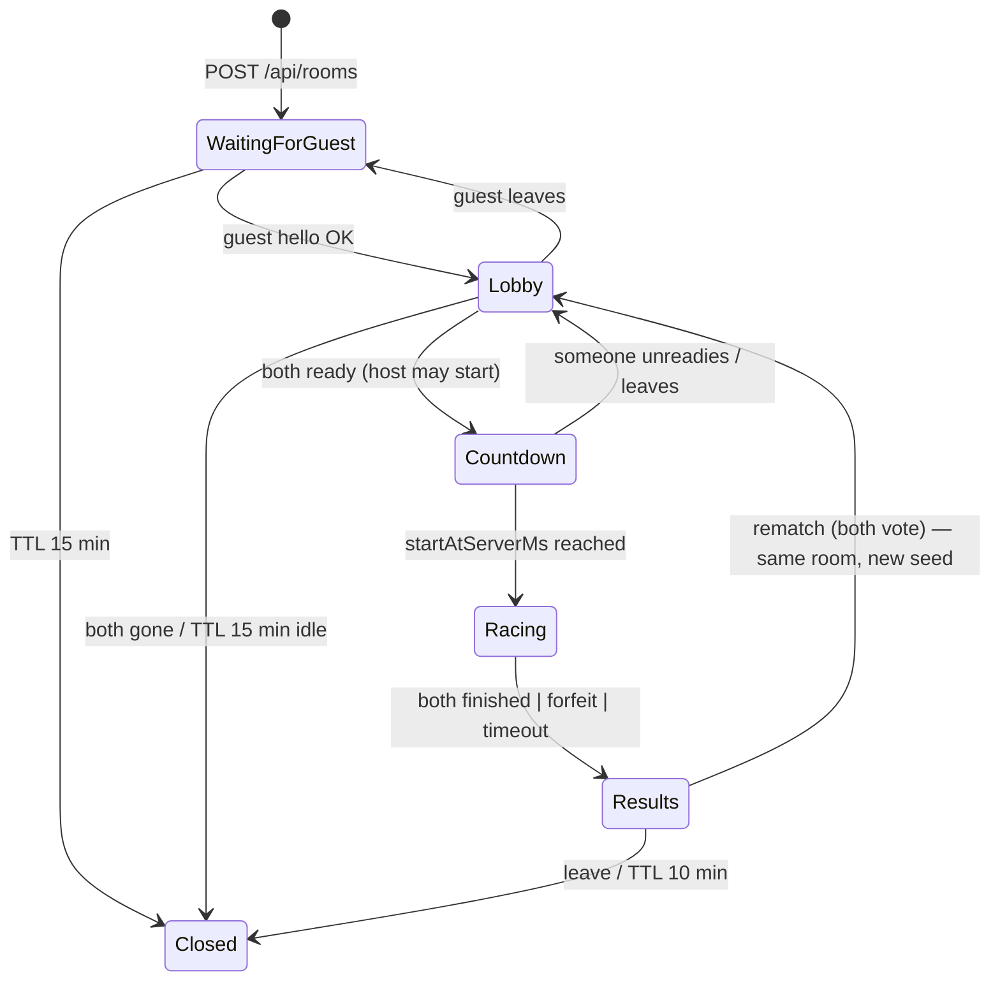

# 04 — MULTIPLAYER (VOICE DUEL) AND AI RACING (CHAMPIONSHIP)

> **Canonical owner of:** bot architecture & fairness invariants, Voice Duel server/room/protocol design, replication, sync, reconnect, anti-cheat, hosting/infra setup list.
> Obeys `02 §0` (CD-06, CD-10: `SIM_HZ=30`, `SNAPSHOT_HZ=10`). Scoring = `03 §7`. Throttle/speed/hazard numbers = `06`.
> Labels: **[VERIFIED]** (2026-10-07) · **[PROPOSED]** · **[UNVERIFIED]** · **[ASSUMPTION]**.
> **Honesty note:** Championship is 100 % local simulation. **Only Voice Duel is networked.** Nothing in this package claims Championship is multiplayer.

---

# PART 1 — CHAMPIONSHIP AI (4 bots)

## 1.1 Design goals
Challenging, believable, **fair**, cheap, and *speech-aware*: bots must "race with their voices" under the **same** rules as the human — they dictate sentences (virtually), get scored by the same formulas, convert score into throttle with the same `BoatDynamics`, earn the same power-ups, and steer around the same hazards.

## 1.2 Fairness invariants (automated tests AI-01…AI-08, §17)
| ID | Invariant |
|---|---|
| **FI-1** | Bots call the **same** `BoatDynamics.step()` and constants as the player. No per-bot speed constant exists; bots differ only through the *inputs* (stroke results, power-up use, steering). |
| **FI-2** | `BotBrain.next(tick, publicView)` receives only **public** information: all boats' `s`, `lat`, `place`, visible hazards/pickups/gates. Never the player's streak, throttle, or sentence state. |
| **FI-3** | **No rubber-banding.** Pace multipliers depend on race progress `p` and persona only — **never on the gap to the player**. (Test: scramble player state; bot timeline stays identical for the same seed.) |
| **FI-4** | Difficulty (*Rival Heat*, level skill) is fixed **before** the race starts and disclosed on the pre-race card. Never changes mid-race. |
| **FI-5** | **Deterministic:** same `(seed, level, heat, persona)` → identical bot timeline. |
| **FI-6** | **Natural variance:** over 1,000 simulated races at fixed skill, finish-time coefficient of variation is 6–14 % (no engineered photo finishes). |
| **FI-7** | Calibration: scripted "skilled" and "casual" players hit the win-rate bands in §1.8 at Standard Heat. |
| **FI-8** | Bots use `evaluateStrokeFromCredits()` (the same scoring code as players) — **no** bonus score or free throttle. |

## 1.3 Skill model
`s_eff = clamp( levelBase(L) + personaOffset + heatOffset , 0, 1 )`

| Level | 1 | 2 | 3 | 4 | 5 | 6 | 7 | 8 | 9 | 10 | 11 | 12 | Endless k |
|---|---|---|---|---|---|---|---|---|---|---|---|---|---|
| `levelBase` | .25 | .31 | .37 | .43 | .49 | .55 | .61 | .67 | .73 | .79 | .85 | .90 | min(.98, .90+.01k) |

`heatOffset`: Chill −0.08 · Standard 0 · Hot +0.08. Persona offsets: Caju 0 · Bebinca +0.03 · Vasco −0.02 · Susegad +0.01.

Derived per-bot parameters (all in `bots.json`):
```
wpmEffBase   = 70 + 90 × s_eff                     // same definition as player wpmEff (includes read+speak+latency)
pAccuracyWord= clamp(0.80 + 0.17 × s_eff + persona.accDelta, 0.50, 0.995)
strokeJitter = lognormal σ = 0.18 × persona.varianceMul × (1 − 0.5 × s_eff)
steerNoise   = (1 − s_eff) × 0.8 m (Ornstein–Uhlenbeck, τ = 0.6 s)
maxLatSpeed  = same as player (06 §5)
```
Reference: player `wpmTarget(L) = 95 + 6(L−1)` (`03 §7.3`). At L1 Standard a bot averages ≈ 92 WPM-eff, at L12 ≈ 151 → bots are slightly below the *target* pace at every level, so a competent player is competitive and a great player wins.

## 1.4 Personalities (numbers)

| Persona | paceMul(p) (piecewise) | accDelta | varianceMul | strokeWords | Nitro policy | Shield | Gates | hazardMissMul | pickupGreed |
|---|---|---|---|---|---|---|---|---|---|
| **Captain Caju** (sprinter) | 1.25 for p<0.40 → 0.85 after (linear blend 0.40–0.50) | −0.04 | 1.2 | 2–3 | `immediate` | auto | attempt 50 % | 1.0 | 0.5 |
| **Maria Bebinca** (metronome) | 0.92 constant | **+0.04** | **0.3** | 3–4 | `saveForSprint` (p ≥ 0.70) | auto | attempt 80 % | 0.6 | 0.6 |
| **Vindaloo Vasco** (aggressor) | 1.05 constant | −0.03 | 1.0 | 2–4 | `immediate` | auto | attempt 70 % | **1.5** (more hazard hits) | **0.9** |
| **Shack Sensei Susegad** (closer) | 0.85 for p<0.50 → 1.00 (0.50–0.75) → **1.20** (p>0.75) | 0 | 0.8 | 3–4 | `hoardUntil p≥0.75` | auto | attempt 60 % | 0.9 | 0.4 |

## 1.5 Sentence-completion simulation (virtual speaker)
Bots consume the **same stage list** as the human for the level (same seed). For each stroke (words `n` taken from the actual stroke text so word-length effects are real):
```
function botStroke(stroke, tick):
  words = stroke.words
  // 1. per-word outcome
  for w in words:
     pCorrect = pAccuracyWord × (w.hardForASR ? 0.85 : 1) × (longWord(w) ? 0.97 : 1)
     r = rng.next()
     credit = r < pCorrect ? 1.0 : r < pCorrect + 0.5*(1-pCorrect) ? 0.8 /*near*/ : 0
  // 2. time model
  baseSec  = Σ(credit>0 ? 1 : 0.5) over words × 60 / (wpmEffBase × paceMul(p))
  duration = baseSec × lognormal(strokeJitter)             // bounded to [0.6×, 1.8×]
  // 3. apply ASR-mercy + retry rules exactly as 03 §5.5/§6 (via shared function)
  result = evaluateStrokeFromCredits(ctx, credits, burstSeconds=duration)
  if result.accuracy < 0.75: schedule retry after 0.35 s with only missed words (duration × 0.7)
  schedule SimEvent StrokeApplied at tick + round(duration × SIM_HZ)
```
`evaluateStrokeFromCredits(ctx, credits[])` lives in `shared/scoring` and is the *second half* of `evaluateStroke` (after alignment) — guaranteeing FI-8.

## 1.6 Steering, overtaking and hazards (cheap steering behaviours)
Per bot per sim tick (30 Hz):
1. **Candidate lateral targets** at 7 evenly spaced offsets across the corridor (plus current).
2. **Cost** = hazard proximity penalty over a 70 m lookahead (using hazard footprints) + pickup bonus × `pickupGreed` (40 m lookahead) + separation penalty from other boats within 6 m (soft, so bots *flow around* rivals visually) + corridor-edge penalty + steering effort.
3. Choose min cost → `latTarget`; move toward it with rate limit `maxLatSpeed` plus OU noise `steerNoise`.
4. **Hazard handling:** if a predicted hit is unavoidable, trigger `HazardHit` (shield auto-consumed if owned). `hazardMissMul` scales the *probability the bot fails to avoid* a hazard it saw (so Vasco bumps more).
5. **Overtaking** is emergent: faster boats (higher `s`) pass; separation steering keeps boats from overlapping. **No boat–boat collisions in any mode** (CD-06 simplification).
6. **Bonus gates:** bot "attempts" with the persona probability; success probability = per-word accuracy for the gate phrase; reward uses the same weighted RNG (seeded).
7. **Ramps/Wave Jump:** uses a charge at a ramp if it has one.

## 1.7 Power-up policies
`immediate`: use Nitro the tick it's earned (if not already active). `saveForSprint`: use when `p ≥ 0.70` or `place ≥ 3 and p ≥ 0.45`. `hoardUntil(p)`: use all charges after threshold. Shield: automatic on hazard hit. Flow State: automatic from the same meter rules (bots feed their `clean` strokes into the same meter code).

## 1.8 Calibration targets (tune `bots.json` until met; automated sim in `tests/` — AI-07)
Scripted players (pace ratio = wpmEff/wpmTarget; stroke accuracy A):
| Scripted player | L1 win% | L6 win% | L12 win% |
|---|---|---|---|
| **Skilled** (ratio 1.00, A 0.93) | 80–90 | 55–65 | 30–40 |
| **Average** (ratio 0.88, A 0.88) | 50–60 | 25–35 | 8–15 |
| **Casual** (ratio 0.72, A 0.80) | 30–40 | 8–15 | 0–3 |
(Win = place 1 of 5 at **Standard** heat; podium rates will be higher.) Placement means are logged to `tests/reports/bot-calibration.json`.

## 1.9 Race-state ownership (Championship)
`RaceDirector` owns `RaceState {tick, boats[5], stageStates[5], powerups[5], events[]}`; the render layer reads `BoatSnapshot`s. Bots live in `shared/bots`, run at `SIM_HZ`, and return `SimEvent[]` for their boat only.

---

# PART 2 — VOICE DUEL (2 players, networked)

## 2.1 Architecture options and trade-offs **[PROPOSED]**

| Option | Pros | Cons | Verdict |
|---|---|---|---|
| **A. Authoritative Node + `ws`, in-memory rooms, shared TS sim** | Tiny, fully controllable, same code client/server, easy tests (two Playwright contexts), server can recompute scores | We write room/reconnect logic ourselves | **CHOSEN (CD-06)** |
| B. Peer-to-peer WebRTC | No game server load | Still needs signalling; NAT traversal; no authority → cheating & desync; more complexity | Rejected |
| C. Colyseus framework | Rooms, state sync, reconnection built-in; **0.18 is current** and supports self-hosting, custom room IDs, JS client **[VERIFIED: https://docs.colyseus.io/]** | New dependency/learning curve; schema sync model doesn't match our deterministic-sim design; heavier | Rejected for MVP; viable alternative if own room code gets messy |
| D. Firebase/Supabase realtime | Zero server code | Latency, no authoritative sim, quotas, API keys | Rejected |
| E. Cloudflare Durable Objects / PartyKit | Managed WebSocket rooms | Account setup, different runtime, harder local tests **[UNVERIFIED current offerings]** | Rejected for MVP |

**Evidence/limits:** Colyseus status verified from its docs; the other options are judged on engineering fit. **Fallback if the server is unreachable at the venue:** run the server on the demo laptop and expose it via a tunnel (§2.15) or LAN with `PUBLIC_BASE_URL=http://<LAN-IP>:PORT` — noting that **webcam QR scanning and the Web Speech/Flow API mic need HTTPS or localhost** **[VERIFIED rule, `03 §1.1` S3]**; Wispr Flow *Desktop* dictation does not depend on that.

## 2.2 Room creation, QR, code and link flows

**Create (host):**
1. Client `POST /api/rooms {name?}` → `{code:"K7M2Q", hostToken, wsPath:"/ws", joinUrl:"<PUBLIC_BASE_URL>/?join=K7M2Q"}`.
2. Client renders: big **code** (mono, 5 chars), **QR** of `joinUrl` (`qrcode` lib, error-correction M, 256 px, quiet zone 4), **Copy link** button, "Waiting for friend…" with pulsing mic ring.
3. Host opens WS `/ws?room=K7M2Q` → `hello{playerToken:hostToken}`.

**Join (guest, own laptop)** — both required options:
| Path | How |
|---|---|
| **Link** | Opens `?join=K7M2Q` → name prompt → auto-join |
| **Enter code** | Title → Voice Duel → *Join* tab "Enter code" (auto-uppercase, strips spaces; alphabet `ABCDEFGHJKMNPQRSTUVWXYZ23456789`) |
| **Scan QR (webcam)** | Tab "Scan QR": `getUserMedia({video:{facingMode:'user'}})` → `BarcodeDetector` (if `'BarcodeDetector' in window` and `getSupportedFormats()` includes `qr_code` **[UNVERIFIED on Windows Chrome → feature-detect]**) else `jsqr` over `canvas.getImageData` at ~10 fps; accepts either a full URL containing `join=` or a raw 5-char code; stops camera on success/leave. |
| **Phone scan** | A phone scanning the host's QR just opens the same link (works, but the friend's laptop is the intended device) |

Errors: `ROOM_NOT_FOUND` ("That code doesn't exist or expired"), `ROOM_FULL`, `ROOM_EXPIRED`, `BAD_VERSION` ("Refresh the page — game updated"), camera denied → fall back to code entry with message.

**Code generation:** `crypto.randomInt` over the 31-char alphabet, 5 chars (≈ 28 M combos), uniqueness checked against live rooms; join attempts rate-limited (5 failures/min/IP → `RATE_LIMITED`).

## 2.3 Lobby lifecycle


Lobby contents (UI `07 §8`): boat select (paint swatches), **Flow check** (say "Goa is calling" — doubles as FlowDetector), host config (course 1 of 6, sentence tier, length Sprint/Classic, best-of 1/3, Voice-only toggle), ready toggles, connection badges, chat-free (no text chat → no moderation burden).

## 2.4 Matchmaking assumptions
None. Private rooms only, exactly 2 players. No public queue, no accounts.

## 2.5 Authority and replication model **[PROPOSED]**

| Concern | Authority | Notes |
|---|---|---|
| Room/phase/start time | **Server** | |
| Stage content & order | **Deterministic from `seed`** — same on both clients and server | `race_init` carries ids |
| **Stroke scoring, stage progress, streak, Flow meter, power-up charges, throttle, longitudinal `s`/`v`, finish time** | **Server** (shared sim at `SIM_HZ=30`) | Client predicts with identical code |
| Lateral position `lat`, yaw | **Client-reported** (10 Hz, clamped) | Server uses it for collision/pickup checks |
| Hazard hits, pickups | **Server-computed** from reported lat path (client claims only trigger cosmetics) | |
| Bonus-gate windows & rewards | **Server** (seeded RNG) | |
| Camera, VFX, audio | Client only | |

No boat–boat collisions. Snapshots at **10 Hz** (`SNAPSHOT_HZ`), ≈ 120 B each → ≈ 2.4 KB/s per client down, ≈ 0.5 KB/s up. **[Budget PROPOSED; validate in MP-12.]**

## 2.6 Race-start synchronisation
**TimeSync (client, `net/TimeSync.ts`):** on connect, 8 pings 100 ms apart `ping{t0}`; server replies `pong{t0, ts}`; `rtt = now − t0`; `offset_i = ts + rtt/2 − now`; keep median of the 5 lowest-RTT samples; refresh every 5 s (`ping` piggybacks on heartbeat).
**Start:** when both ready (or host presses Start) server sets `startAtServerMs = nowServer + 4500`, broadcasts `race_init`. Clients map to local time `startLocal = startAtServerMs − offset` and run the visual 3-2-1-GO so that **GO = startLocal**. Early-bird bursts (`03 §2 F14`) are allowed because pace uses `burstMs` (difference-based).
**Target:** inter-client GO skew ≤ 150 ms (typical ≤ 60 ms on a good network). **[PROPOSED target; test MP-03 with injected latency 0/50/150 ms.]**

## 2.7 Sentence and challenge synchronisation
`race_init = {seed, courseId, tier, stageCount, contentIds: string[], gateIds, hazardSeed, startAtServerMs, simHz:30, rulesVersion}`. Both clients build identical `CourseData` and stages. Each player advances through stages at **their own pace** (no lock-step). Server stores `stageState[playerId]`.

## 2.8 Progress, power-ups and gate replication
- `snap` carries per-player: `s, lat, v, thr, stage, stroke, streak, score, place, nitroUntilTick, shield, flow, finished`.
- Power-up **earn/activate** are server events (`event{kind:'powerup', who, type, action:'earn'|'activate'|'expire'}`); client shows VFX immediately for its own activation request (optimistic) and reconciles on the event.
- **Gates:** server opens `gate_open{gateId, phrase, expiresAtServerMs}` per player when that player's `s` reaches `gate.s − 110 m` (closes at the arch or after 8 s; `06 §10`); server routes bursts (`03 §8.4`), emits `gate_result{gateId, success, reward?}`.

## 2.9 Latency compensation
1. **Pace is clock-offset-free:** clients send `burstMs` (a *difference* of local timestamps). Server clamps `burstMs ∈ [250, elapsedSinceStrokeShownOnServer + max(250, rtt)]`.
2. **Own boat:** local prediction using the same sim and input events; keep a 2-second ring buffer of predicted states by tick; on snapshot at tick *t*: `Δs = server.s − predicted[t].s`; `|Δs| < 0.5 m` ignore; `< 3 m` blend over 300 ms; else snap + brief "resync" shimmer.
3. **Opponent:** snapshot interpolation with a **150 ms** render delay (`renderTime = serverNow − 150`), extrapolate ≤ 250 ms using last `v`.
4. Stroke acks (`stroke_ack`) arrive ≈ RTT after submission; local prediction already applied the stroke, so the player never feels network lag.

## 2.10 Disconnect and reconnect
- Client keeps `playerToken` (sessionStorage + localStorage) and `roomCode`.
- WS close → client shows "Reconnecting…", retries with backoff 0.5/1/2/4 s up to **30 s**; sends `hello{playerToken, room}`.
- Server holds the seat **30 s** (`RECONNECT_GRACE_MS`). During the gap the player's boat **coasts** (no inputs → throttle decays naturally; nothing is auto-played), the opponent sees a "⚠ reconnecting" badge on that boat.
- On success server sends `room_state` + `race_resume{fullSnapshot, stageState, powerups, pendingEvents}`.
- Grace expired → **forfeit** (`race_end reason:'forfeit'`), winner awarded; lobby disconnect → seat freed; host gone > 30 s in lobby → host role passes to the guest; both gone → room closed after TTL.
- Duplicate connections for one token: newest wins, old socket closed with `4001 REPLACED`.

## 2.11 Race completion, timeouts and rematch
- Server detects finish when `s ≥ courseLength`; finish time = interpolated server tick time.
- After the first finisher: others get `FINISH_GRACE_SEC = 30`; unfinished are ranked by progress and marked DNF.
- `RACE_HARD_TIMEOUT = parTime × 2.5` (≤ 6 min).
- **Results phase:** `race_end{results:[{id, place, timeMs, score, accuracy, bestStreak, flowStats, anomalyFlags}], reason}`.
- **Rematch:** each client `rematch_vote{yes}`; both yes → phase `Lobby` (ready states reset, **new seed**, `wins` kept) and auto-countdown after 3 s if both still present. **Best-of-3:** room tracks `wins`; match ends at 2 wins.

## 2.12 Anti-cheat and abuse controls
| Threat | Control |
|---|---|
| Fake score / skipping strokes | Server recomputes from text; client score ignored |
| Inflated pace | `burstMs` bounds (§2.9); `wpmEff > 260` flag; min gap 250 ms between bursts |
| Pasting future sentence text | Alignment window = current + next stroke only |
| Typed instead of spoken | `source:'keyboard'` classified (`03 §4.1`); "Voice-only duel" option rejects it; otherwise ⌨ shown in results; **cannot prove speech** (stated honestly) |
| Teleport / superhuman steering | `lat` rate-limited (`maxLatSpeed`+10 %); hazard/pickup checks server-side |
| Command spam | Server cooldowns (nitro 4 s, jump 3 s), charge checks |
| Message flood | ≤ 30 msgs/s/socket, ≤ 4 KB/msg, zod validation, drop + warn; 3 violations → close 4008 |
| Room-code brute force | 5 failed joins/min/IP; codes expire |
| Cross-site socket hijack | Check `Origin` header against `PUBLIC_BASE_URL` host (and localhost in dev) |
| Resource exhaustion | Max 3 rooms/IP, 200 rooms global, room TTLs, memory-only state |
| XSS via names | Names ≤ 16 chars, `[\p{L}\p{N} _.-]` allowlist; always rendered as text nodes |

## 2.13 DATA CONTRACTS (`packages/shared/src/protocol`, zod-validated, `PROTOCOL_VERSION = 1`)

```ts
// Envelope: every message = { v:1, t: <type>, ...payload }
// ---------- Client → Server ----------
type Hello      = { t:'hello'; name:string; room:string; playerToken?:string };
type Ping       = { t:'ping'; t0:number };
type SelectBoat = { t:'select_boat'; boat:'canoe'|'shack'|'ferry'|'dhow'|'cat'; paint:string };
type Ready      = { t:'ready'; ready:boolean };
type HostConfig = { t:'config'; course:1|3|5|8|10|12; tier:1|2|3; length:'sprint'|'classic'; bestOf:1|3; voiceOnly:boolean };
type StartReq   = { t:'start' };                                  // host only
type Burst      = { t:'burst'; seq:number; stageIdx:number; strokeIdx:number;
                    text:string /*≤600*/; source:'flow-desk'|'web-speech'|'flow-api'|'keyboard'|'mock';
                    burstMs:number; insertType?:string; flags?:string[] };
type Cmd        = { t:'cmd'; name:'nitro'|'jump'|'skip' };
type Pos        = { t:'pos'; seq:number; lat:number; yaw:number };   // 10 Hz
type RematchVote= { t:'rematch_vote'; yes:boolean };
type Leave      = { t:'leave' };

// ---------- Server → Client ----------
type Welcome    = { t:'welcome'; playerId:string; playerToken:string; role:'host'|'guest'; serverTime:number; rulesVersion:string };
type Pong       = { t:'pong'; t0:number; ts:number };
type RoomState  = { t:'room_state'; code:string; phase:'waiting'|'lobby'|'countdown'|'racing'|'results'|'closed';
                    players:{id:string;name:string;boat:string;paint:string;ready:boolean;connected:boolean;wins:number}[];
                    config:{course:number;tier:number;length:'sprint'|'classic';bestOf:number;voiceOnly:boolean} };
type RaceInit   = { t:'race_init'; seed:number; courseId:number; tier:number; stageCount:number;
                    contentIds:string[]; gateIds:string[]; hazardSeed:number; startAtServerMs:number; simHz:30; rulesVersion:string };
type Snap       = { t:'snap'; tick:number; ts:number; p:{ id:string; s:number; lat:number; v:number; thr:number;
                    stage:number; stroke:number; streak:number; score:number; place:number;
                    nitroUntil:number; shield:0|1; flow:number; fin:0|1 }[] };
type StrokeAck  = { t:'stroke_ack'; seq:number; tickApplied:number; result:StrokeResultCompact; routed:'main'|'gate'|'ignored'|'duplicate'|'stale' };
type GameEvent  = { t:'event'; kind:'powerup'|'hazard'|'pickup'|'gate_open'|'gate_result'|'overtake'|'finish'|'anomaly'; who:string; data:Record<string,unknown> };
type RaceEnd    = { t:'race_end'; reason:'finish'|'forfeit'|'timeout'; results:ResultRow[]; matchWins:Record<string,number> };
type PeerStatus = { t:'peer'; id:string; connected:boolean; graceMs?:number };
type RaceResume = { t:'race_resume'; tick:number; snap:Snap; stage:StageStateCompact; powerups:PowerupStateCompact };
type ErrorMsg   = { t:'error'; code:'ROOM_NOT_FOUND'|'ROOM_FULL'|'ROOM_EXPIRED'|'BAD_VERSION'|'RATE_LIMITED'|'NOT_HOST'|'BAD_STATE'|'BAD_PAYLOAD'|'REPLACED'|'KICKED'; message:string };
```
`StrokeResultCompact = { sc:number /*score*/, a:number /*accuracy 0-1*/, w:number[] /*status codes per word*/, c:0|1 /*clean*/, sd:0|1 /*stage done*/, thr:number, fl:number }`. HTTP: `POST /api/rooms`, `GET /api/health`, `GET /api/config → {publicBaseUrl, flowApiEnabled}`, `GET /api/flow/token` (optional).

## 2.14 Security boundaries
1. **Trust nothing from the client** except `name`, `boat/paint` (allow-listed), `lat/yaw` (clamped), and raw text bursts (treated as untrusted input to the aligner).
2. All inbound messages pass zod schemas; unknown `t` → `BAD_PAYLOAD`.
3. The Wispr API key (`WISPR_API_KEY`) **never** leaves the server; browser gets only short-lived client tokens (S5/S6).
4. No audio is transmitted to or stored by our server. No analytics.
5. TLS: production behind HTTPS (`wss`). Dev: localhost.
6. No secrets in the repo; `.env.example` only.

## 2.15 Hosting and manual setup (human tasks — list for `08 §5`)
| Item | Why | Notes |
|---|---|---|
| **Pick a host** | Duel needs a reachable server | Options: (1) the **demo laptop** + tunnel (e.g., Cloudflare Tunnel `cloudflared`, ngrok) for instant HTTPS; (2) a small PaaS (Render / Fly.io / Railway) running `node apps/server/dist/index.js`. Free-tier limits & pricing **[UNVERIFIED — check on the day]**. Needs WebSocket support and HTTPS. |
| **`PUBLIC_BASE_URL`** | QR/link correctness | Must equal the externally visible origin |
| **Firewall/LAN** | If using venue Wi-Fi | Client isolation on public Wi-Fi often blocks LAN play → prefer tunnel/PaaS or phone hotspot |
| **Wispr Flow account** | Primary voice input | Each player installs/sign-in on their laptop; Pro features (Command Mode) optional |
| **Wispr API access (optional)** | `FlowApiProvider` | **Exclusive access** (`03 §1.1` S4) — request via enterprise@wisprflow.ai; otherwise ignore |
| **Node 22** on the server host | Runtime | |

## 2.16 Multiplayer failure scenarios
| Scenario | Expected behaviour |
|---|---|
| Invalid/expired code | `ROOM_NOT_FOUND`/`ROOM_EXPIRED` toast; stay on join screen |
| Third person joins | `ROOM_FULL` |
| Host closes tab in lobby | Guest promoted host after 30 s or room closes if alone |
| Guest never joins | Room closes after 15 min; host sees "Room expired — create new" |
| Player drops mid-race ≤ 30 s | Resume seamlessly |
| > 30 s | Forfeit; results flag `forfeit` |
| Server restarts | Clients see `close 1006` → retry → `ROOM_NOT_FOUND` → "Room lost — create a new room"; no crash |
| Clock skew/huge RTT | TimeSync uses medians; if RTT p95 > 400 ms show "Connection weak" badge |
| Both players' Flow offline | Fallback providers still work |
| Client protocol mismatch | `BAD_VERSION` + reload hint |
| Duplicate tab for same token | Old tab gets `REPLACED` |

## 2.17 Acceptance tests (IDs referenced by `08 §9`)

**AI**
| ID | Test | Pass |
|---|---|---|
| AI-01 | FI-1 static check: bots reference only `BoatDynamics.step` | grep/AST test passes |
| AI-02 | FI-2 `publicView` type excludes player private state | type-level test |
| AI-03 | FI-3 scramble player state → identical bot timeline | byte-equal |
| AI-04 | FI-5 determinism | byte-equal over 3 runs |
| AI-05 | FI-6 variance 6–14 % CV | stats test over 1,000 sims |
| AI-06 | Persona signatures: Caju leads at p=0.3 more often than at p=0.8; Susegad inverse | probabilistic assertions |
| AI-07 | Calibration table §1.8 | within bands (±5 pts) |
| AI-08 | Bots earn power-ups only via the §rules (no free charges) | event audit |

**Multiplayer**
| ID | Test | Pass |
|---|---|---|
| MP-01 | `POST /api/rooms` returns valid code; QR decodes to the join URL (round-trip with `jsqr`) | ✓ |
| MP-02 | Guest joins by (a) link, (b) code, (c) scan simulation | all reach Lobby |
| MP-03 | Start sync with injected latency 0/50/150 ms | GO skew ≤ 150 ms |
| MP-04 | Same stages/hazards on both clients | content ids identical |
| MP-05 | Cheat: client sends inflated `burstMs` | clamped; flag |
| MP-06 | Cheat: client sends text for a later stage | ignored |
| MP-07 | Server vs client scoring parity (1,000 bursts) | identical |
| MP-08 | Disconnect 10 s mid-race, reconnect | resumes; boat state continuous |
| MP-09 | Disconnect 35 s | forfeit |
| MP-10 | Rematch both vote | same room, new seed, wins kept |
| MP-11 | Invalid code, full room, expired room | proper error codes |
| MP-12 | Bandwidth ≤ 4 KB/s down / ≤ 1 KB/s up per client | measured |
| MP-13 | Flood 100 msgs/s | socket closed 4008 |
| MP-14 | Origin mismatch | handshake refused |
| MP-15 | Photo-finish reveal shows identical winner on both clients | ✓ |
