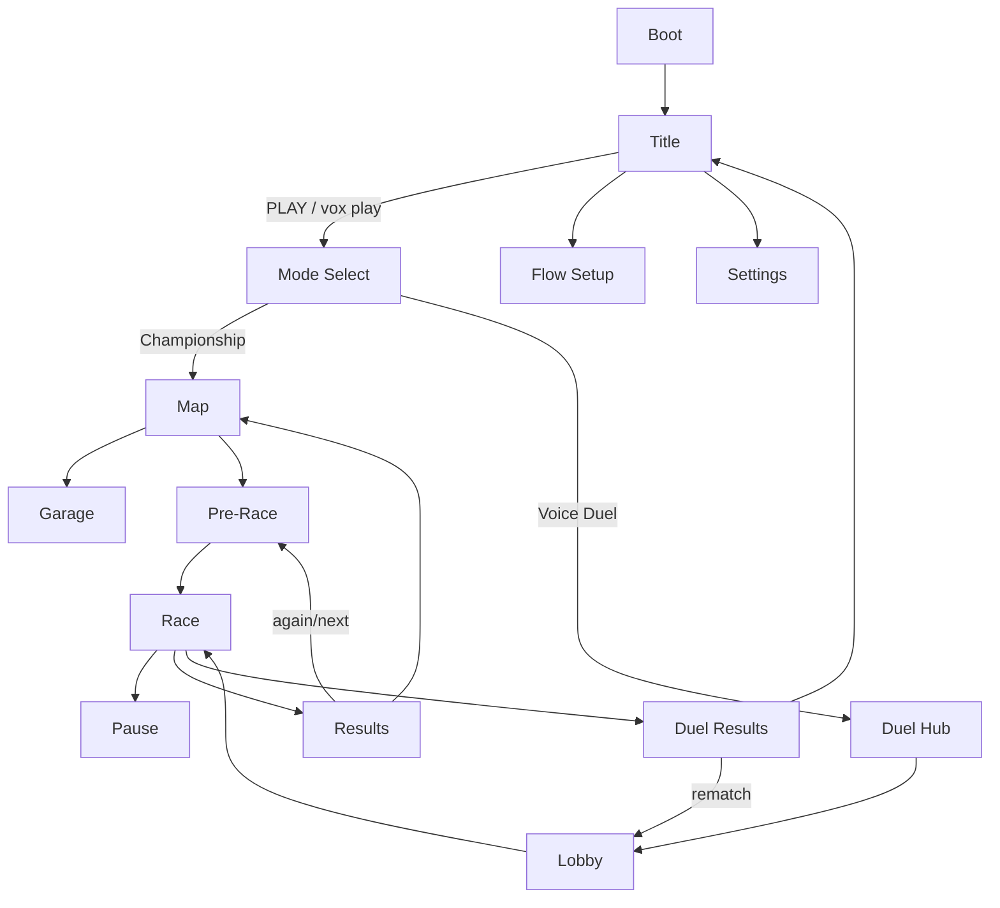
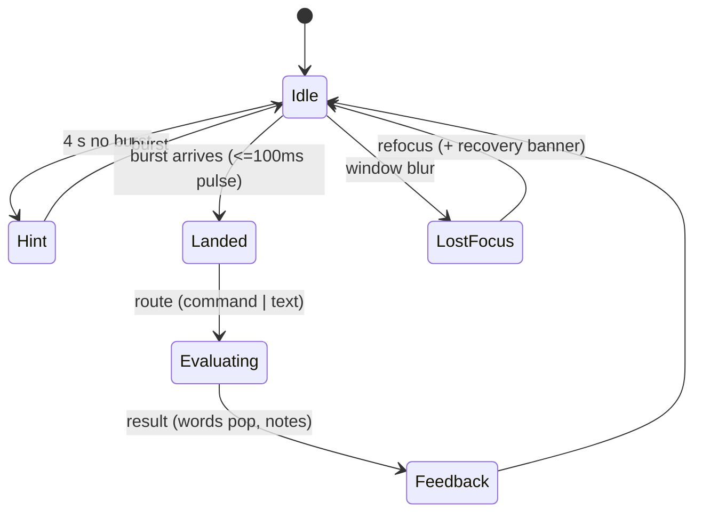
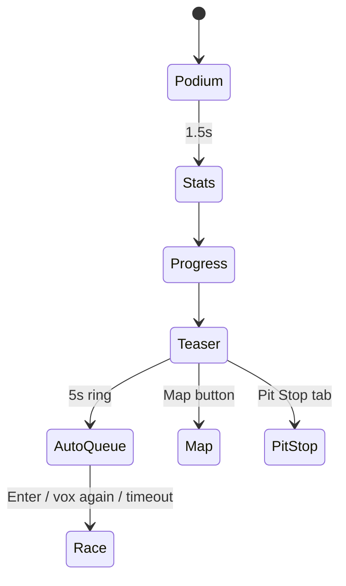

# 07 — UI / UX, AUDIO AND PRESENTATION

> **Canonical owner of:** every screen's purpose and flow, the race HUD (target-sentence display, word highlighting, live transcript, streak/Flow, power-up chips, command feedback), Duel hub/QR/join/lobby UI, results/rematch, settings, accessibility, audio design and commentary, presentation sequences, input/navigation rules.
> Obeys `02 §0` (CD-08 controls, CD-13 Preact UI). Look & tokens: `05 §4, §17`. Voice logic: `03`. Numbers: `06`.
> Reference screens: `reference_images/REF_01…04` (structure only; never copy their text/logos).

---

## 1. UX principles

1. **Voice-first, hands-split:** *left hand* holds the **Wispr Flow key**, *right hand* drives the **mouse** (steer, LMB Nitro, RMB Jump). No keyboard letters needed anywhere.
2. **The sign is the star.** The sentence sign is always the largest, highest-contrast element; nothing may overlap it.
3. **Feedback within 100 ms of any burst arriving**, even before scoring finishes (a "text landed" pulse).
4. **Never a dead end:** every error state has a one-click way forward (Keyboard assist, Skip, Retry, Back).
5. **Paper-card system** (REF_03): cream cards, hard offset shadow, magenta kicker, ✦ bullets, 3-tier buttons, alert boxes.
6. **Honest UI:** estimates are labelled "est."; Flow detection says "looks like"; Duel says "play-fair".
7. **Decorative UI is banned** unless it carries information or Goa identity at zero gameplay cost.
8. **Voice navigation everywhere sensible** (`[[play]] [[again]] [[menu]] [[ready]]`), but every action also has a mouse path.

---

## 2. Screen inventory and navigation

| # | Screen | Purpose | Primary action |
|---|---|---|---|
| S1 | **Boot/Splash** | Load config, build procedural kit, resume AudioContext on first click | "Click to start" (needed for audio) |
| S2 | **Title** | Identity + entry (REF_04 structure) | PLAY |
| S3 | **Mode Select** | Exactly two cards: Championship · Voice Duel | choose |
| S4 | **Flow Setup** | ≤ 60 s Wispr Flow setup (`03 §14`) | Done/Skip |
| S5 | **Garage** | Pick boat, paint, decal, horn, wake | Select |
| S6 | **Championship Map** | Coast signpost: levels, Endless Tide, Daily Regatta | pick level |
| S7 | **Pre-Race card** | Course, rivals, Heat, ghost, tips | START |
| S8 | **Race (HUD)** | The game (§7) | speak |
| S9 | **Pause** | Resume/Restart/Settings/Quit (Championship) | Resume |
| S10 | **Results** | Placement, stats, XP, teasers (§11) | Race again / Next |
| S11 | **Pit Stop** (tab of Results) | Misheard words → copy to Flow dictionary | Copy |
| S12 | **Duel Hub** | Create room / Join (QR, code, link) | Create / Join |
| S13 | **Duel Lobby** | Boats, Flow check, config, ready | Ready |
| S14 | **Duel Results + Rematch** | Winner reveal, rematch vote | Rematch |
| S15 | **Settings** | Voice, audio, visual, gameplay, privacy, data | — |
| S16 | **Profile/Collection** (P1) | Rank, Word Log, fluency chart, cosmetics | — |
| S17 | **System overlays** | Mic blocked, Flow not detected, connection lost, update needed, WebGL error | contextual |



---

## 3. Title screen (S2) — structure from REF_04

```
┌────────────────────────────────────────────────────────────────────────┐
│ [VOXWAKE mark]                               FLOW SETUP   SETTINGS  ▶PLAY│  ← stitched-border yellow CTA (REF_04 "APPLY" pattern)
│                                                                          │
│     V O X  ·  W A K E   (giant yellow Didone, dark drop shadow)          │
│                      ┌─────┐  magenta sticker (Devanagari, rotated −6°)  │
│  GOA, INDIA · CHAMPIONSHIP · VOICE DUEL            YOUR VOICE IS THE ENGINE│  ← mono meta line
│                                                                          │
│                  ☀ rising sun with rays (animated)                       │
│   palm leaves frame bottom corners; grain + vignette on deep green       │
└────────────────────────────────────────────────────────────────────────┘
```
- On load: sun rises 1.2 s; wordmark letters drop with a slight overshoot; gulls cross once.
- A small **Flow status chip** bottom-left: "Wispr Flow: looks ready ✓ / not set up — [Set up]".
- PLAY → Mode Select; if first run → Flow Setup first (skippable).
- Idle 20 s: ambient camera sway; no attract-mode video.

## 4. Mode Select (S3) and Flow Setup (S4)

**Mode Select:** two large paper cards side by side.
| Card | Content |
|---|---|
| **CHAMPIONSHIP** | kicker "SOLO · 4 RIVALS"; line "Race the Goa coast. 12 levels, then Endless Tide."; mini signpost art; progress "Level 4 · ★ 7/36"; button **Continue** (yellow) / **Level map** (outline) |
| **VOICE DUEL** | kicker "1 v 1 · ONLINE"; line "Invite a friend by QR or code."; mic-in-dashed-ring art; buttons **Create room** / **Join** |

Exactly **two** cards — no third mode.

**Flow Setup (S4)** UI (logic `03 §14`): vertical stepper on a paper card; left column steps 1–6, right column live panel. Components: OS toggle; *Say hello* panel with the real FlowDeck and a big mic-in-dashed-ring (REF_03) that pulses when text arrives; hotkey table; snippet table with **Copy** buttons (trigger/expansion); dictionary **Copy all**; calibration lap launcher. Success states use ✓ + green; warnings use the REF_03 pink alert box. Footer: **Skip for now** (outline) · **Done** (yellow).

---

## 5. Garage (S5)
Carousel of 5 boats on a turntable (3D view over the table POV scene), stat bars (Speed / Turn / Stability / Nitro — deltas ±5 % only, shown as small pips), paint swatches (palette tokens), decals (azulejo patterns), horn (4), wake colour (3). Locked items show rank requirement with ghosted silhouette. **Apply** auto-saves. A Tiffin Crate button appears when crates are available (opens with a short 1.5 s animation, shows item, pity counter "Epic in ≤ 3").

## 6. Championship Map (S6) — structure from REF_02
- **Signpost** (wooden post, centre) with **12 arrow signs** alternating left/right, yellow/magenta, each showing level number, name, 3 star pips; locked signs are greyed with a padlock and *rattle* on hover; the current level has a bobbing boat icon.
- Two **special signs** above: **ENDLESS TIDE** (anchor icon, best depth) and **DAILY REGATTA** (sun icon, streak calendar) — locked until L3 is cleared.
- Hover/focus → right-hand **preview card**: course name, time-of-day thumbnail, par time, best time + ghost toggle, rival line-up (4 portraits), **Rival Heat** selector (Chill/Standard/Hot with XP ×0.8/×1/×1.3), "New: ferries" mechanic chip.
- Background: slow day-cycle beach scene with the sun semicircle, sailboat silhouette, umbrella, deck chairs, scooter (REF_02 props).
- **Cliff-hanger rule:** after finishing a level, the map auto-scrolls to the **next** sign, which flashes "NEW" and plays a 3-s mini-teaser of that course.

---

## 7. RACE HUD (S8) — canonical layout

Reference canvas **1920×1080**; DOM overlay; all positions in `vw/vh` or CSS grid with `clamp()`.

```
┌─────────────────────────────────────────────────────────────────────────────┐
│ SCORE 12,480  ×1.6        ┌───────── STAGE 7 ─────────┐             P1 ▲ 2/5 │
│ 00:41.3                    │  Please pass the bebinca  │   [rope]    ▇ Caju  │
│                            │  before the monsoon …     │             ▇ You   │
│  ◉ Flow ring               └───────────────────────────┘             ▇ Bebinca│
│  ✦ streak ladder   ┌ GATE: “Catch the tide” ⌛ ┐ (only when active)  ▇ Vasco │
│  ×1.0 ░░░░░░░░░░   └───────────────────────────┘                      ▇ Susegad│
│                                                                               │
│                   ⟵ 3D WORLD (boat low-centre) ⟶     "SMOOTH!"               │
│                                                                               │
│ [NITRO ▸ LMB ●●] [SHIELD auto ●] [JUMP ▸ RMB ●]   ┌ FLOW DECK ▭▭▭ ◍ ┐    ⌖ speed │
│                                                    │ “please pass the…”│   ▮▮▮▯ T │
│  minimap strip ───●──────◆──●─────⚑─────────▶     └───────────────────┘  cadence◔│
└─────────────────────────────────────────────────────────────────────────────┘
```

### 7.1 Target Sentence Sign (hanging rope sign, REF_01)
- Cream card with magenta kicker **"STAGE n"**, hard offset shadow, **two ropes** from the top edge, scalloped awning lip; gentle sway (2° at 0.5 Hz; frozen under `reducedMotion`).
- **Typography:** mono, **sentence case** (not all-caps: faster to read aloud), **34 px @1080p**, line-height 1.35, max width 62 vw, up to 2 lines (Long Haul: 3). Text scale setting 80–140 %.
- The **current stroke** is bracketed by a soft yellow highlight bar; upcoming strokes at 70 % opacity; completed strokes at 100 % with fill.
- **Stage transition:** sign swings out/in (250 ms) with a **stamp** "STAGE 8" and chime.

### 7.2 Word highlighting states (never colour-only)
| State | Visual | Non-colour cue |
|---|---|---|
| pending | ink on cream | — |
| **active** (first unresolved of current stroke) | magenta-deep text + 3 px underline | bold weight |
| **credited exact** | yellow fill pill, ink text | tiny ✓ glyph (top-right, 10 px) |
| **credited near** | yellow pill | ✓ + thin wavy underline |
| **mercy** | yellow pill with dotted underline | ◐ glyph + tooltip "Flow may have misheard" (Pit Stop) |
| **missed** | pink-red outline (`--alert-ink`), no fill | ✕ glyph |
| gate phrase words | same states in the small gate sign | |
Pop animation on credit: scale 1 → 1.18 → 1 in 120 ms (skipped under `reducedMotion`; replaced by a 200 ms background flash at ≤ 2 Hz).

### 7.3 Live transcript / FlowDeck strip
- A **visible** strip under the main play area — the *real* `<textarea>` styled as a small cream card with the **mic-in-dashed-ring** (REF_03). Contents: provider chip (**"Wispr Flow ✓"**, "Browser mic", "Keyboard assist"), the **last burst** text sliding in (typewriter 150 ms) then fading after 1.2 s, and, for Web Speech, **interim** text in grey italics.
- **Idle hint** after 4 s with no burst: "Hold your Flow key and read the highlighted words" (+ OS-correct key names from setup).
- **Text-landed pulse** (≤ 100 ms): ring flashes yellow, tick sound.
- **"Flow is thinking…"** shimmer on the sign when > 600 ms since the expected release (cosmetic, `03 §10`).
- **Lost-Wake banner** (REF_03 alert box) when focus was lost: "Click the game, then press **Shift+Alt+Z** (Windows) / **⌘⌃V** (Mac) to re-insert your last phrase."
- **Never** shows raw text of the opponent.

### 7.4 Accuracy, streak, cadence and Flow State
- **Streak ladder:** 10 pips vertical, ×1.0 → ×2.0 labels; milestone pops at 3/5/8/10 with callouts *SMOOTH → ON FIRE → UNSTOPPABLE → PERFECT*.
- **Flow ring:** circular meter (magenta→yellow gradient) around the mic icon; at 100 % it ignites: **FLOW STATE** banner, screen-edge glow, 8-s countdown arc.
- **Accuracy readout:** last stroke % as a small stamp near the sign ("100 %", "86 %") + stage accuracy at stage end.
- **Cadence:** a small metronome arc; turns solid when "Perfect Rhythm".
- **Throttle:** thin 5-segment bar near the speed arc.

### 7.5 Power-up chips (arrow-sign style, REF_02)
Three arrow-shaped chips bottom-left: **NITRO** (LMB glyph, charge pips ●●, cooldown radial), **SHIELD** (auto, ● when held, pulse when earned), **JUMP** (RMB glyph, ● when held, glows near a ramp). Earning a charge: chip bounces + chime + a 1.2-s toast "+1 NITRO". Keyboard-alternative glyphs (↑/↓) shown when keyboard steering is selected.

### 7.6 Voice command feedback
- **Recognised:** the target chip flashes yellow with a ⚡ badge if it arrived via **Flow snippet** (`[[nitro]]`) or 🎙 if spoken (`vox nitro`); short blip. A toast line under the sign: "NITRO ⚡ via snippet".
- **Rejected:** "No Nitro yet" (grey chip shake, no penalty).
- Commands **never** show in the transcript strip as sentence text.

### 7.7 Position, minimap, gate and misc
- **Positions list** (right): 5 rows with boat icon, name (rival colours), place number, gap ("+0.8 s" computed from distance/speed); **your row highlighted**; overtakes animate row swaps with an "OVERTAKE +1" callout. Duel: two bars + big gap.
- **Minimap strip** (bottom): progress line with 5 dots, 3 gate markers (◆), checkpoints (⚑), Final Sprint zone shaded (last 20 %).
- **Gate sign:** small card under the main sign: phrase with the same word states + **countdown ring** + arrow showing the arch lateral position.
- **Callout layer** (centre, 1.2 s each, queue max 2): SMOOTH!, OVERTAKE!, SHIELD!, FLOW STATE!, FINAL SPRINT!, PHOTO FINISH!
- **Speed:** arc gauge (m/s ×3.6 shown as "km/h") + speed lines.
- **Debug/judge overlay** (`?judge=1`): Flow Stats strip + **Flow Lens** timeline (P1).

### 7.8 HUD performance rule
Per-frame values (speed, ring) update via **direct DOM refs/CSS variables** at ≤ 30 Hz; Preact re-renders only on discrete events (stroke results, power-up changes). Animations use `transform`/`opacity` only.

---

## 8. VOICE DUEL UI (S12–S14)

### 8.1 Duel Hub (S12)
Two big tabs: **CREATE** and **JOIN**.

**CREATE** (after `POST /api/rooms`):
```
┌──────── ROOM CODE ────────┐   ┌───── QR ─────┐
│     K 7 M 2 Q   [Copy]    │   │  ▓▓▒▒▓▓▒▒   │   "Friend: scan with your laptop webcam
└───────────────────────────┘   │  ▓▒▓▓▒▓▒▓   │    (Join → Scan QR) or type the code."
  [Copy invite link]            └──────────────┘
  ◍ Waiting for your friend… (pulsing mic ring)        [Cancel room]
```
- Code in **big monospace** (alphabet excludes 0/O/1/I/L); QR 256 px with 4-module quiet zone and a cream frame; **link copy** with toast "Copied!". Status text updates the moment the guest joins ("Aarav joined ✓").
- Errors: server unreachable → REF_03 alert box with **Retry** and **Play Championship instead**.

**JOIN** has two sub-tabs plus deep-link handling:
| Sub-tab | UI |
|---|---|
| **Enter code** | 5 big character boxes (auto-uppercase, paste fills all, strips spaces/dashes); **Join** button; inline errors: "Code not found or expired", "Room is full" |
| **Scan QR** | live camera preview in a rounded frame with a square target overlay; hint "Hold the host's QR in view"; **permission denied** → alert "Camera blocked — use the code instead" and auto-switches to *Enter code*; **BarcodeDetector** if available else `jsqr`; on success: haptic-style flash, auto-join; camera stops immediately |
| **Deep link** `?join=CODE` | Title is skipped: a card "Join room K7M2Q?" + name field + **Join** |
Name field (≤ 16 chars) remembered.

### 8.2 Duel Lobby (S13)
Two **seat cards** (host left, guest right): name, boat preview (rotating), paint swatches, **Flow check** badge ("Say *Goa is calling*" → ✓ "Looks like Wispr Flow" / ✕ "Using keyboard"), connection badge (●online / ◌reconnecting), **READY** toggle. Centre: **host config** (course 1 of 6 thumbnails, sentence tier E/M/H, **length Sprint/Classic**, best-of 1/3, **Voice-only duel** toggle). Footer: "Same room? Use headsets — try Whisper Mode in Wispr Flow." and the honest note "Voice Duel is play-fair: we check pace and text patterns but can't prove you spoke." Both ready → **3-s lobby countdown** → synchronized race start (`04 §2.6`). Leave button at bottom-left.
**Microphone test:** for Flow — the *say hello* test (no browser mic needed); for browser speech — "Test mic" button requests permission and shows a live level meter (cosmetic); permission failures use the alert box with steps.

### 8.3 Duel Results + Rematch (S14)
- **Photo-finish reveal** (both screens identical): last 3 s replay in slow-mo, split view of the two boats crossing; winner banner with confetti; loser sign **"REVENGE?"**.
- Stats comparison table (score, time, accuracy, best streak, bursts, WPM-eff, power-ups used), plus Flow Stats for each (your own full, opponent's limited to counts). ⌨ marker if a player used typed assist (shown only here).
- **Rematch** big yellow button + 20-s ring; opponent's vote shown ("Waiting…"/"✓ wants a rematch"). Best-of-3 scoreboard "1–0". If both vote → back to Lobby with ready states cleared and **auto-countdown 3 s**.

---

## 9. Pause and Settings (S9, S15)

**Pause (Championship only):** Resume (default), Restart race, Settings, Quit to map. Opened via **F1** or the small ⏸ button or `vox pause`. *Never Esc* (Flow cancel). Sim and audio ducked; bursts ignored; 3-2-1 soft resume.
**Duel:** F1 opens a **non-pausing** overlay (volume, leave race).

**Settings sections**
| Section | Controls |
|---|---|
| **Voice** | Voice engine (Auto / Wispr Flow / Browser speech / Keyboard assist), language (en-IN default / en-US / en-GB), hotkey profile (Windows default / Mac default / Custom — drives hint text), steering (Mouse / Keyboard), **typed assist** toggle, Flow Setup (**Redo**), snippets reminder ("Remove snippets from Flow when you're done") |
| **Audio** | Master / Music / SFX / Ambience sliders, **Voice Focus** (default ON: lowers music ~6 dB & removes vocal-like sounds so the mic stays clean), subtitles for sounds |
| **Visual** | Quality (Auto/Low/Med/High), **Reduced motion**, text scale 80–140 %, **High contrast**, **Dyslexia-friendly font**, **Colour-blind palette**, camera shake/FOV kick toggles |
| **Gameplay** | Default Rival Heat, steering assist (Off/Light/Strong), steering sensitivity, break reminder |
| **Privacy** | Plain-language list of what leaves the device (`03 §13`) |
| **Data** | Export/Import save (JSON), Reset progress (confirm) |
Settings persist immediately (`SettingsStore`).

---

## 10. PRESENTATION SEQUENCES

| Sequence | Spec |
|---|---|
| **Race start** | 3-s skippable **fly-by** of the course highlights → boats line up with rope-hung **start sign** → **3 · 2 · 1 · GO** (each number a hanging sign that swings down with a bell; low→high pitch) → "GO!" burst. Hint: "Hold your Flow key now". Early-bird bursts (`03 §2 F14`) accepted in the last 1000 ms. Rivals announce themselves with a text line each. |
| **Stage transition** | Sentence sign swings, stamp, chime, wake pulse; commentary line sometimes. |
| **Checkpoint** | Flag-post pass: soft tick + split-time pop ("−0.4 vs ghost"). |
| **Bonus gate** | 110 m before: second sign unfurls, bunting arch glows; success: confetti + chip bounce; failure: gentle "next time" (no red). |
| **Final Sprint** (last 20 %) | "FINAL SPRINT" banner, camera pulls back +1.5 m, music **up a whole step and +8 % tempo**, bank crowds wave, score ×1.25 badge, positions list pulses. |
| **Finish** | Chequered bunting gate; **finish orbit** camera; if gap < 0.6 s → **PHOTO FINISH** slow-mo freeze with overlay. |
| **Victory (1st)** | Podium diorama, horn, confetti, rival taunt/concession lines; XP bar fills with ticks; unlock fanfare. |
| **Podium (2nd–3rd)** | "On the podium!" + star prompt for next star. |
| **Defeat (4th–5th)** | "So close…" tone, **never negative**: shows *what cost you time* and a one-key **Race again** (Enter / `vox again`); XP still awarded. |
| **Rematch reveal (Duel)** | Split-screen last-3-s replay; loser's sign "REVENGE?"; winner's boat does a horn salute. |
| **Level teaser** | 3-s mini fly-through of next course + new-mechanic chip, 5-s auto-queue ring (cancel with click). |

---

## 11. RESULTS (S10) — canonical layout

```
┌───────────────────────────────────────────────────────────────────────────┐
│ ★★☆  LEVEL 4 · ANJUNA GOLDEN HOUR            [Results][Cost you time][Pit Stop][Flow Stats]│
│ ┌ PODIUM ┐  ┌ STATS ───────────────┐  ┌ PROGRESS ─────────────────────────┐│
│ │1 You   │  │ Score 12,480         │  │ XP +312  ▓▓▓▓▓▓░░ Rank 4 → 5 (88 XP)││
│ │2 Caju  │  │ Time 01:11.2 (par 72)│  │ ★★ Win  · next ★: no hazard hits   ││
│ │3 Bebinca│ │ Accuracy 91 %        │  │ 🎁 Tiffin Crate ×1  (Epic in ≤ 3)  ││
│ │4 Vasco │  │ Best streak 9        │  │ NEXT: L5 Fontainhas — new: shortcut ││
│ │5 Susegad│ │ Flow: 142 words, 31 bursts, ~118 WPM, 0 typed, est. 2:05 saved││
│ └────────┘  └──────────────────────┘  └─────────────────────────────────────┘│
│  [ RACE AGAIN  ⏎ / vox again ]  [ NEXT LEVEL ▶ ]  [ Pit Stop ]  [ Map ]       │
└───────────────────────────────────────────────────────────────────────────┘
```
- **Cost you time** tab: top-2 insights with a mini timeline (slowest strokes, hazards, idle gaps) and a concrete tip ("Strokes of 5+ words cost you ~1.1 s each — try 3-word beats").
- **Pit Stop** tab: list of mercy/asr-suspect words ("bebinca → heard *bibinca*") with **Copy dictionary entries**; short how-to for Flow's dictionary.
- **Flow Stats** tab (also summarised on the main tab): `03 §15` metrics in a REF_03-style card; "est." labels.
- **Auto-queue:** teaser strip + 5-s ring; Enter or `vox again` immediately starts the **same** level; `Next level` goes forward if unlocked.

---

## 12. Victory / defeat tone guide
Celebrate small, console big, always offer a one-click next action. Copy bank in `commentary.json` (§14.4). No shaming, no "You lose" text — use "Photo finish!", "So close!", "Nice wake!".

---

## 13. ACCESSIBILITY (checked by UI tests + manual)

| Feature | Spec |
|---|---|
| **Colour independence** | Every state has glyph/pattern cues (§7.2); optional **colour-blind palette** swaps magenta/yellow/green pairs for blue/orange/ink-safe pairs |
| **Contrast** | Text ≥ 4.5:1 (large ≥ 3:1) using `--magenta-deep` on cream etc. (`05 §4`); verified by script |
| **Text size** | 80–140 % scale, layout reflows (sign up to 3 lines) |
| **Reduced motion** | No sign sway, shake, FOV kick, flashes, parallax; pop animations replaced by 200 ms fades; **no flashing > 2 Hz anywhere** (lightning/fireworks capped) |
| **Dyslexia-friendly font** | Optional (e.g., OpenDyslexic-like **[UNVERIFIED font package]**) for the sign and transcript |
| **Subtitles for sound** | Text captions for horn/bell/commentary/thunder cues |
| **Input alternatives** | **Typed assist** (keyboard) for players who can't or don't want to speak; **Hands-free** recommendation for limited hand use; **Voice commands** for power-ups; **steering assist** levels; one-handed play with hands-free Flow + mouse |
| **Screen readers** | Menus use semantic buttons with labels; race HUD exposes an `aria-live="polite"` region that announces stage completion/results, **not** every word |
| **Focus visibility** | 3-px outline in `--sun` on `--green-deep` for all focusable items |
| **Language** | `lang="en"`; Hinglish pack (P2) marks text `lang="hi-Latn"` where relevant |
| **No time pressure in menus** | Auto-queue timer pauses on hover/focus |

---

## 14. AUDIO DESIGN

### 14.1 Principles
- **Procedural WebAudio** (no shipped samples in P0): marimba/pluck (Karplus-Strong or FM), shaker (noise bursts), dholki-like hand drum (sine + noise with pitch drop), soft pad, bells (additive partials), gull chirps (FM), wash/wind (filtered noise), horn (two detuned saws).
- Buses: `master → music | sfx | ambience | ui`; compressor on master; SFX voice cap ≤ **24 concurrent**; per-cue cooldowns.
- **Mic-safe design:** the game **never outputs speech** (no TTS, no vocal samples) so speaker bleed cannot be mistaken for the player's dictation; **Voice Focus** (default ON) trims music ~6 dB and low-passes high-frequency busy layers; recommend **headsets** in setup and demo checklist.
- Audio context resumes on the first click (S1).

### 14.2 Cue table (`audio.json`)
| Cue | Trigger | Sound |
|---|---|---|
| **Word tick** | each credited word | pluck on **C-major pentatonic** degrees (1 2 3 5 6) climbing one step per word within a stroke (max 8 steps, then wraps up an octave) |
| **Stroke complete** | stroke passes | soft chord (triad) + shaker accent; pitch ∝ accuracy |
| **Stage chime** | stage complete | two-note bell + whoosh |
| **Streak milestones** | 3 / 5 / 8 / 10 | rising arpeggio stingers |
| **Flow State on/off** | meter full | shimmer pad swell + stinger / downward sweep |
| **Nitro** | activate | filtered-noise sweep up + sub thump; loop wind while active |
| **Shield earn / absorb** | event | chime / glassy pop |
| **Hazard hit** | hit | woody thud + splash |
| **Pickup (cashew)** | collect | quick crunchy tick + sparkle (pitch climbs with chain) |
| **Gate open / success / fail** | event | two ding / bright chord / soft "womp-less" low tick |
| **Jump / landing** | event | whoosh / splash |
| **Overtake / overtaken** | position change | whoosh up / soft descend |
| **Countdown** | 3,2,1,GO | low bell ×3, high bell + horn |
| **Final Sprint** | enter | key +2 semitones, tempo +8 %, snare roll |
| **Finish / win / lose** | | fanfare (major, brass-like saws) / gentle resolve |
| **UI** | click / hover / error | paper-flap tick / soft pop / muted bonk |
| **Text landed** | burst arrives | tiny "tink" (≤ 60 ms) — immediate acknowledgement of Flow's text |

### 14.3 Music stems (tempo 112 BPM, key of C major pentatonic with Goan-flavoured modal turns allowed)
`base groove` (always) → `melody` (streak ≥ 3) → `percussion fill` (streak ≥ 6) → `choir/pad shimmer` (Flow State). Stems crossfade on beats (quantised to 1 bar). Menus: laid-back loop with sea ambience.

### 14.4 Dynamic commentary (text only; `commentary.json`)
Categories with cooldowns (global 2.5 s; per-line no repeat within 12 picks): *start, streak, overtake, overtaken, hazard, shield, nitro, flowState, finalSprint, win, lose, closeFinish, idle, rival-specific, level-specific*. Shown as a one-line subtitle under the callout layer in the rival's colour.
Samples:
- start: "Engines up! Voices up!" · "Say it loud, sail it proud."
- streak: "Smooth as a Fontainhas lane." · "That wake is pure susegad."
- overtake: "Bye-bye, Bebinca!" · "You passed Caju like he's anchored!"
- overtaken: "Vasco's coming in hot!" · "Susegad wakes up…"
- hazard: "Mind the buoy, Captain!" · "Splash and carry on!"
- shield: "Shield up — not today, log!"
- nitro: "Caju crunch! Nitro on!"
- flowState: "FLOW STATE — you ARE the engine."
- finalSprint: "Final sprint — everything you've got!"
- win: "First past the fort!" · "Champion of the coast!"
- lose: "So close — the tide turns again." · "Rematch? The sea waits."
- closeFinish: "Photo finish!!"
- idle: "Hold your Flow key and read the sign!"
- rival: Caju "Cashew crunch, baby!" · Bebinca "Slow and layered wins." · Vasco "Too hot for you!" · Susegad "No hurry… yet."

---

## 15. Responsive layout and scaling
- **Reference 1920×1080**; minimum supported **1100×620** (below: "Please enlarge your window / use a laptop").
- HUD anchors: top-centre sign, left rail, right list, bottom rail; use CSS grid + `clamp()`; UI scale = `min(vw/1920, vh/1080)` clamped 0.65–1.4 × user text scale.
- **Short/wide windows:** collapse positions list to icons; **ultrawide:** keep HUD within a 16:9 safe frame; **DPR > 2** renders UI at CSS pixels, canvas capped by quality.
- No mobile layout in MVP (P2); layout must not crash on small screens.

## 16. Visual hierarchy rules
1. Sentence sign (largest, highest contrast).
2. Flow ring + streak ladder + callouts.
3. Position list + minimap.
4. Power-up chips.
5. Score/time/speed (smallest).
Only the sign and callouts may exceed 28 px; everything else 14–20 px (scaled). Maximum **7 simultaneous HUD elements** in the default race view (gate sign, banners appear temporarily).

## 17. UI state diagrams

**FlowDeck / burst feedback**

**Results flow**

**Duel lobby** — see `04 §2.3`; UI mirrors `waiting → lobby → countdown → racing → results`.

## 18. Input and navigation rules
| Rule | Detail |
|---|---|
| **Focus** | In **race, countdown, setup, lobby, results**, the **FlowDeck** textarea holds focus. In **menus** a hidden-but-focusable *Voice Bar* (same component) can receive voice commands. Text inputs we own (code boxes, name field) temporarily take focus without being stolen back. |
| **Mouse** | Primary for all UI; pointer steering in race; LMB/RMB power-ups; scroll disabled in race. |
| **Keyboard** | Menus: ↑/↓/←/→ move focus, **Enter** activates, **Tab** cycles. Race: only F1 (pause), optionally ←/→/↑/↓ when keyboard steering is chosen. `F9` log, `F8` Flow Lens (judge). |
| **Never bound** | **Esc** (Flow cancel), **Space**, printable keys, Ctrl/Win/Fn combos, Shift+Alt+Z/X, Cmd+Ctrl+V/C. |
| **Voice** | `[[play]] [[again]] [[menu]] [[ready]] [[pause]] [[nitro]] [[jump]] [[skip]]` (`03 §8`). |
| **Back navigation** | Every screen has an on-screen **Back**; no Esc dependency. |
| **Focus ring** | Always visible for keyboard users; `:focus-visible`. |
| **Timers** | Auto-queue/lobby countdowns pause on pointer hover. |

---

## 19. ACCEPTANCE CRITERIA (IDs for `08 §9`)
| ID | Criterion |
|---|---|
| UI-01 | Main flow has exactly two mode cards; no third mode anywhere |
| UI-02 | Title matches REF_04 structure (wordmark, sticker, mono meta line, stitched CTA, sun rays) |
| UI-03 | Championship map uses the signpost pattern with 12 arrow signs + Endless + Daily; locked signs rattle |
| UI-04 | Sentence sign states (§7.2) all render with glyph cues; passes colour-blind simulation |
| UI-05 | Burst arrival acknowledgement ≤ 100 ms (measured with `MockProvider`) |
| UI-06 | FlowDeck never loses focus for > 100 ms during a race (e2e) except on real blur; Lost-Wake banner appears on blur |
| UI-07 | Command chips flash with ⚡/🎙 badge; rejected commands shake without penalty |
| UI-08 | HUD never overlaps the boat at default FOV on 16:9 and 16:10 (screenshot test) |
| UI-09 | Duel Hub shows code + QR + copy link; QR decodes to the join URL |
| UI-10 | Join supports code, link and webcam QR; camera denied falls back to code |
| UI-11 | Lobby shows both seats, Flow check, config, ready; honest play-fair note present |
| UI-12 | Photo-finish reveal and rematch vote work on both clients |
| UI-13 | Results show Flow Stats (with "est."), cost-you-time, Pit Stop, next-level teaser, auto-queue |
| UI-14 | Esc is not bound anywhere (grep + e2e); F1 pauses (Championship) |
| UI-15 | Reduced-motion removes sway/shake/FOV kick/flashes; no element flashes > 2 Hz |
| UI-16 | Text scale 140 % keeps the sign readable and unclipped |
| UI-17 | All screens operable by mouse only; voice navigation works for play/again/menu/ready |
| UI-18 | Contrast script passes for all token pairs used |
| UI-19 | Audio: no speech output exists; Voice Focus trims music; cue cooldowns respected; ≤ 24 voices |
| UI-20 | Layout holds at 1280×720, 1366×768, 1920×1080, 2560×1080 |
